# TD2 
## Exo 1 
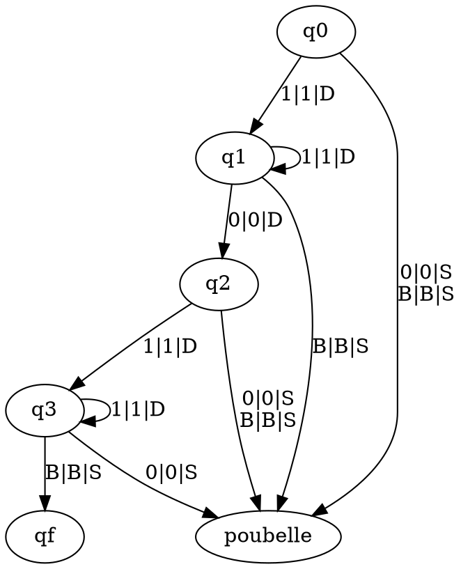
// the same in mermaid
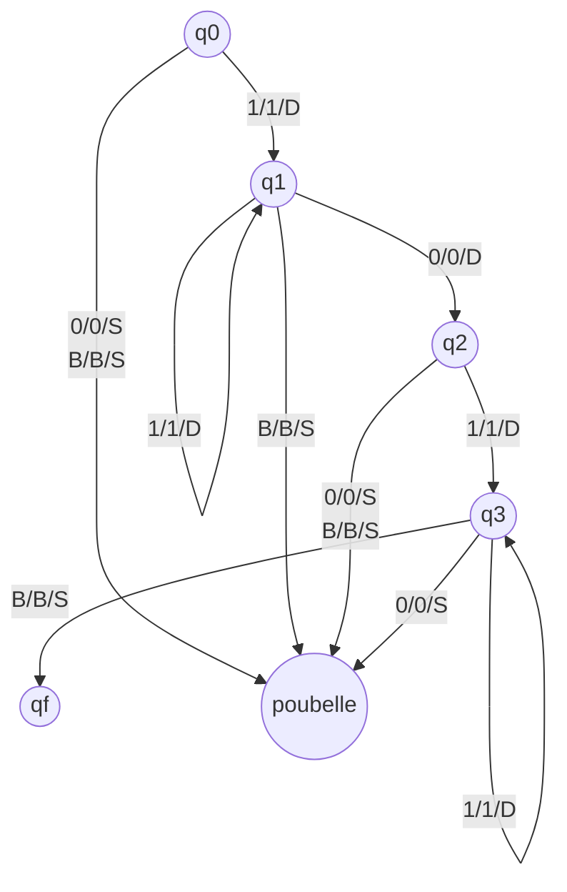

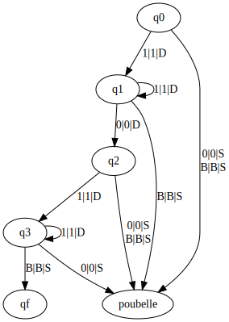

## Exo 2
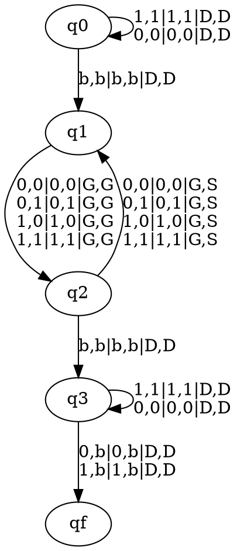
// the same in mermaid
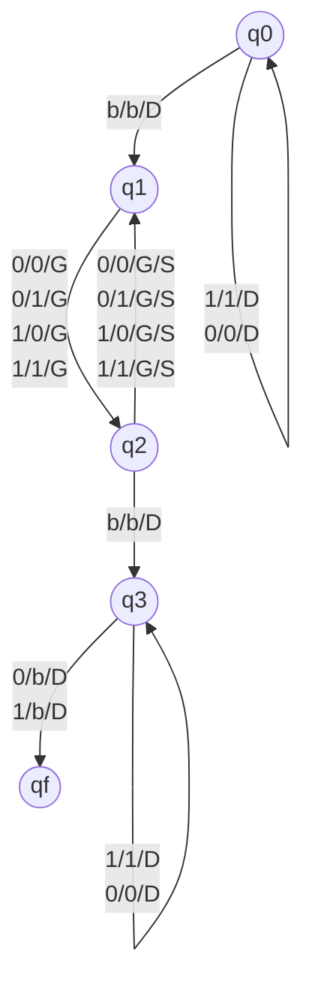

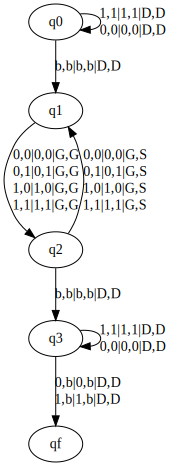

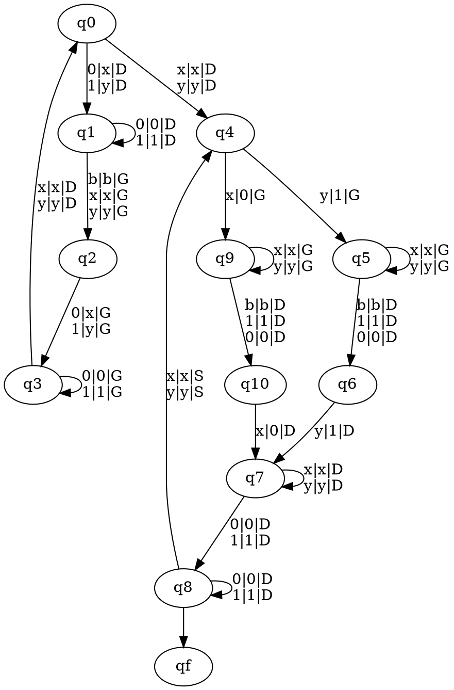
// the same in mermaid
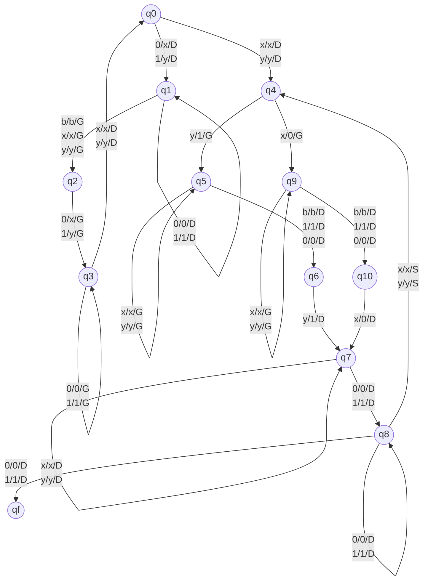

## Exo 3
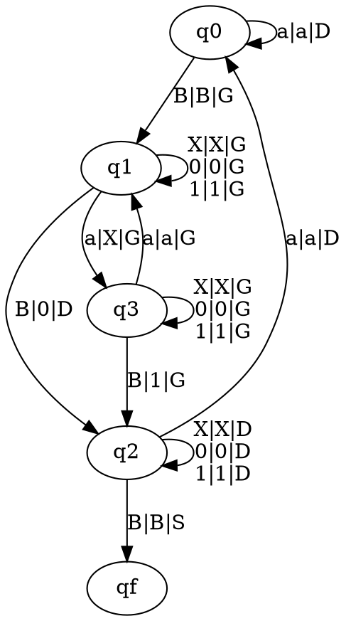
// the same in mermaid
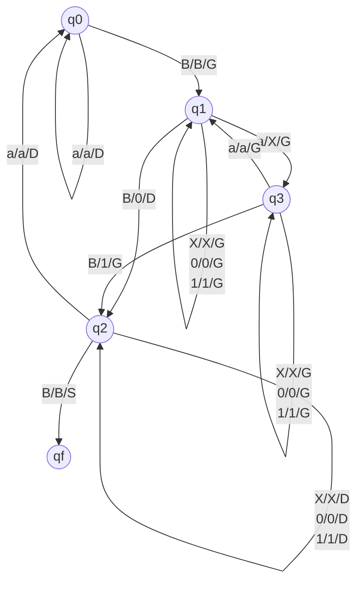

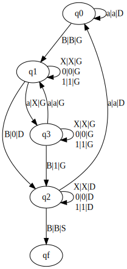

## Exo 4
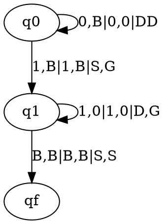
// the same in mermaid 
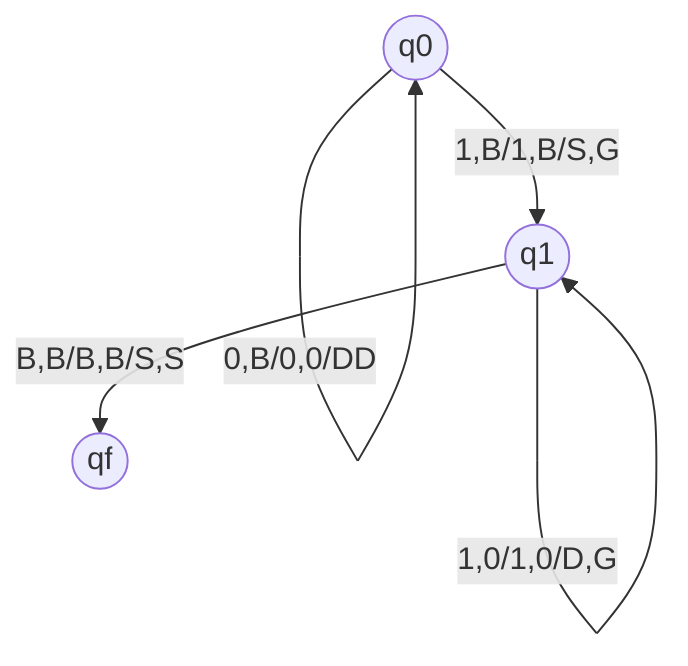

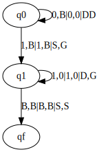

## Exo 5
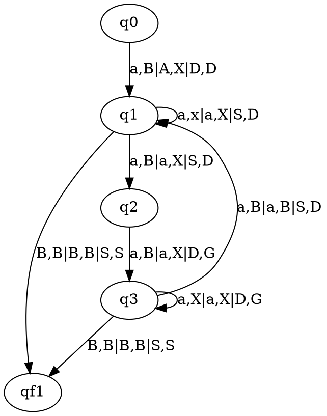
// the same in mermaid 
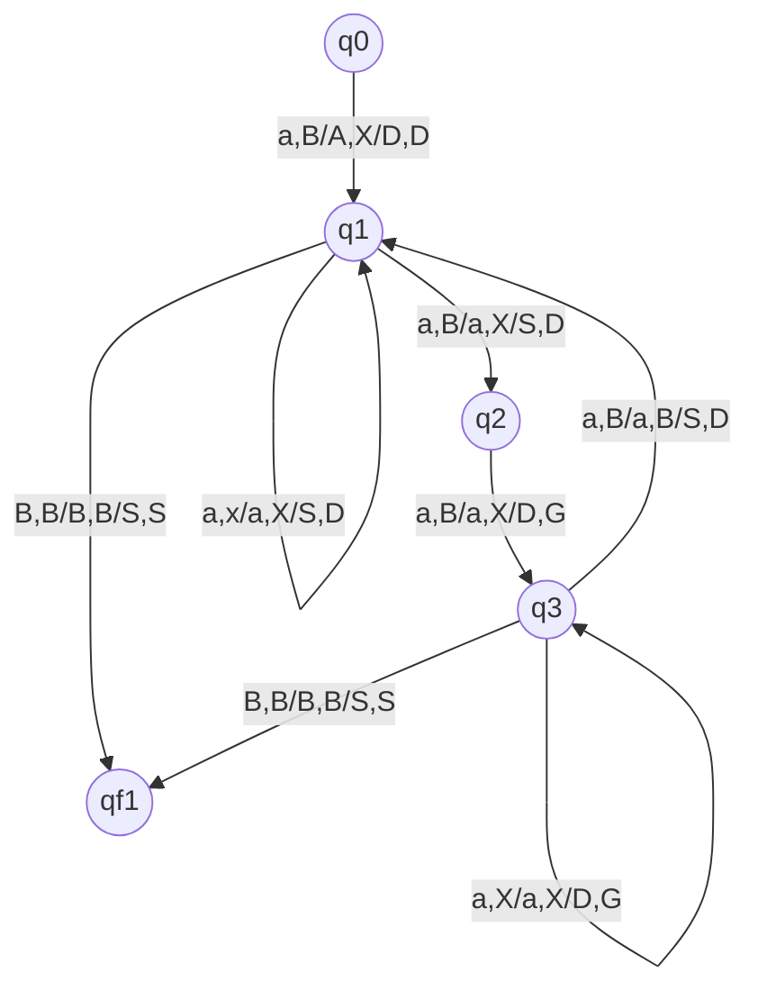
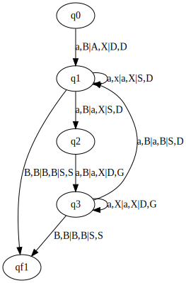

## Exo 6
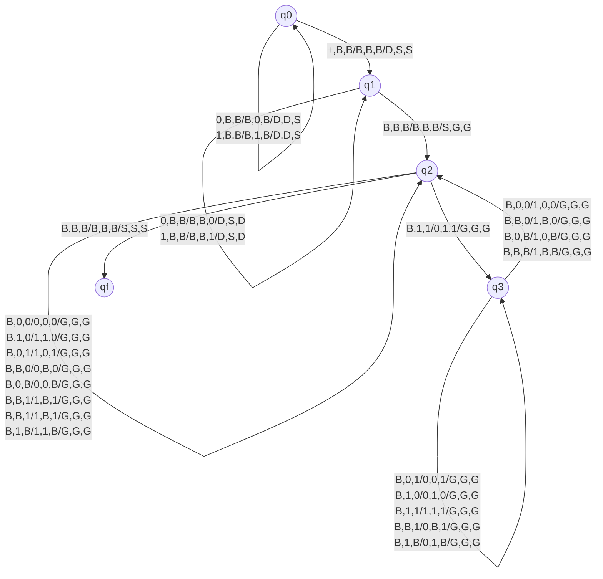