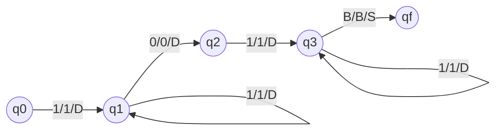
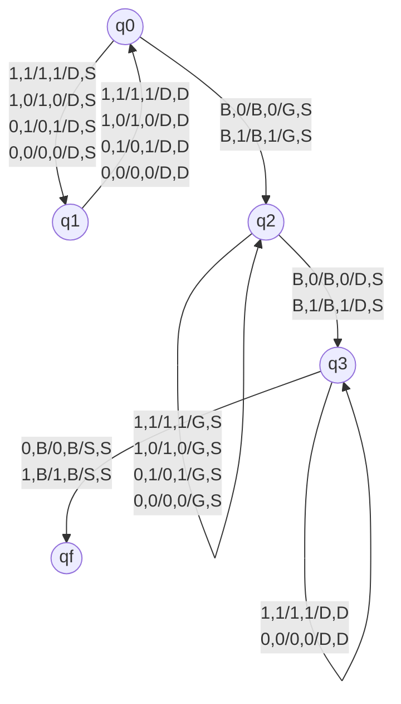
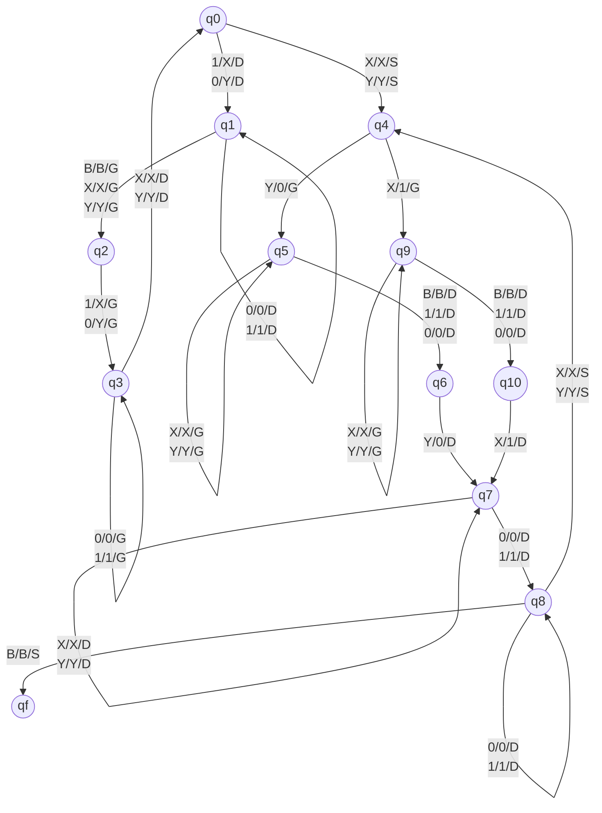
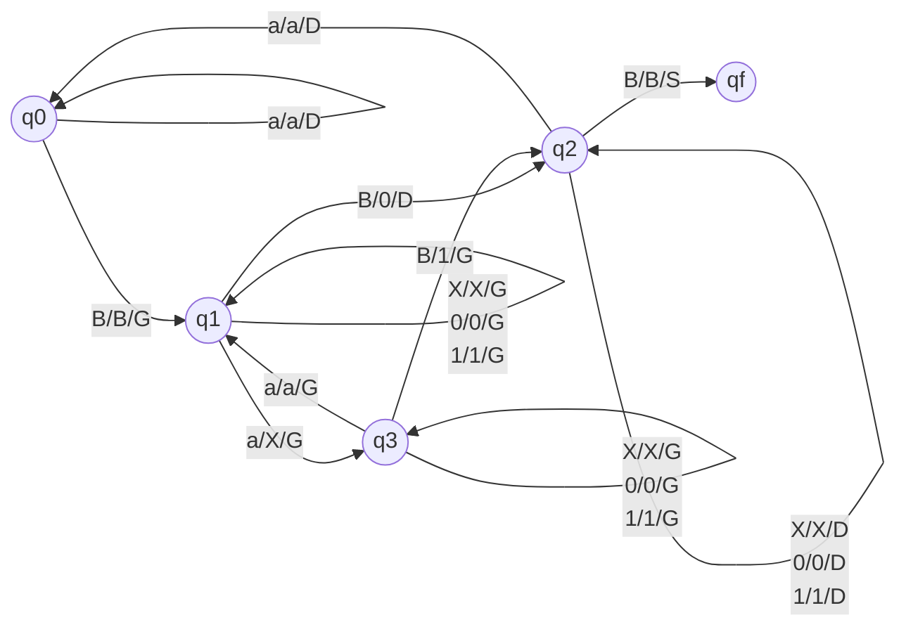
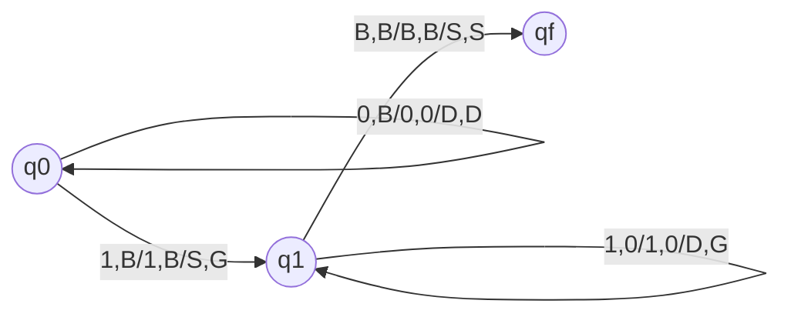
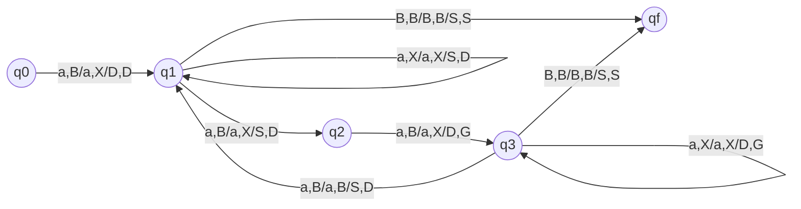
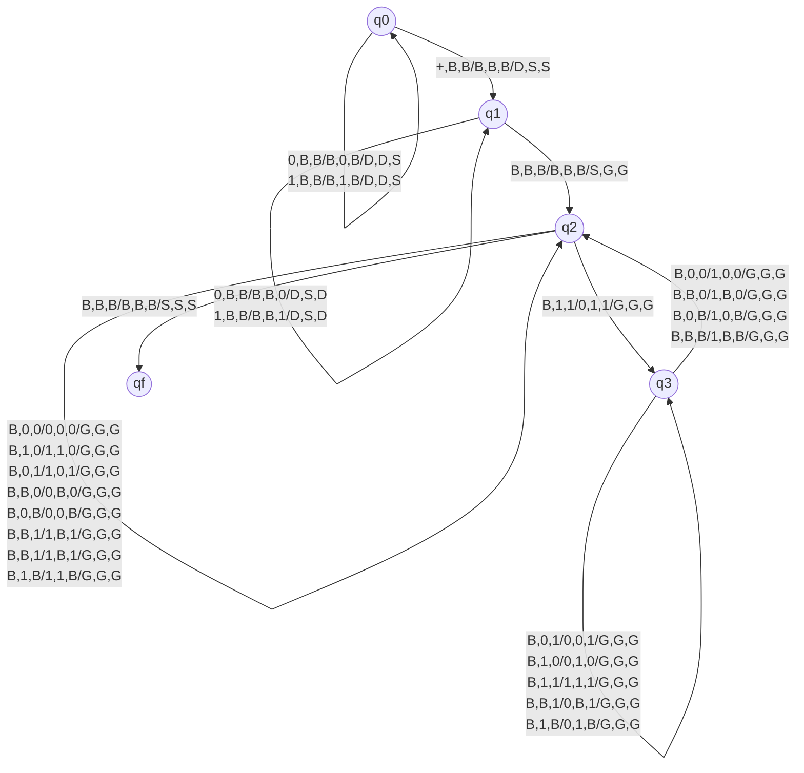

# TD2

## Exercice 1

Décrire de manière détaillée une machine de Turing déterministe à un seul ruban qui
reconnaît le langage des mots composés d’un nombre en binaire qui contient exactement un
0 et qui n’est ni en première ni en dernière position.
Exemples de mots du langage : 11011111 ; 101111111 ; 11111101 ; 101

### Réponse exercice 1



## Exercice 2

Décrire de manière détaillée une machine de Turing déterministe à deux rubans qui reconnaît
le langage des mots composés d’un nombre en binaire répété deux fois.
Exemples de mots du langage : 011011 ; 1111 ; 101011101011 ; 000111000111

Même question avec une machine de Turing déterministe à un seul ruban.

### Réponse exercice 2

#### Partie 1 : 2 rubans

Hypothèse : 2 rubans avec le même mort et les têtes de lecture à gauche de chaque ruban.



Calcul de la complexité :

$$
\sum_{i=0}^{n} i = \frac{n(n+1)}{2} = O(n^2)
$$

Demo :

```math
\left.
    \begin{align*}
        1 + n &= n+1\\
        2 + n-1 &= n+1\\
        &\vdots\\
        n-1 + 2 &= n+1\\
        n + 1 &= n+1
    \end{align*}
\right \}
n\text{ fois}
```

Donc $\sum_{i=0}^{n} i = \frac{n(n+1)}{2}$ (/2 car on a pris 2 fois la suite dans la demo)

#### Partie 2 : 1 ruban



Complexité : $O(n^2)$

## Exercice 3

Nous considérons le problème du calcul de la longueur en binaire d’un mot sur l’alphabet {a, b}
donné en entrée.

- Décrire une machine de Turing à deux rubans qui effectue le calcul et évaluer sa
  complexité.
- Même question avec un seul ruban.
- Comment améliorer la complexité de votre machine précédente (à un seul ruban) afin
  d’obtenir une complexité de O(n log n) ?
- En déduire une machine à deux rubans de complexité linéaire ?



## Exercice 4

Décrire de manière détaillée une machine de Turing déterministe à deux rubans qui reconnaît
le langage des mots $\{0^k1^k : k > 0\}$. Quelle est la complexité de votre machine ?
Premiers mots du langage : 01 ; 0011 ; 000111



## Exercice 5

Décrire de manière détaillée une machine de Turing déterministe à deux rubans qui reconnaît
le langage des mots (à une lettre a)  dont la longueur est un carré parfait.
Premiers mots du langage : a ; aaaa ; aaaaaaaaa ; aaaaaaaaaaaaaaaa



## Exercice 6

Décrire de manière détaillée une machine de Turing déterministe qui fait l’addition de deux
nombres binaires. Le nombre de rubans est trois. Vous pourrez également écrire une machine
de Turing avec deux rubans et ensuite un ruban.



## Exercice 7

Décrire de manière détaillée une machine de Turing déterministe à un seul ruban qui trie les
lettres d’un mot écrit sur l’alphabet {x, y}.
Exemple : si le mot est xyxxy alors le résultat sera xxxyy

Même question avec l’alphabet {x,y,z}.
