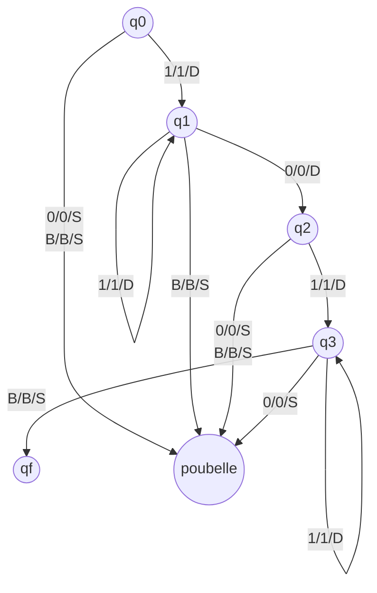
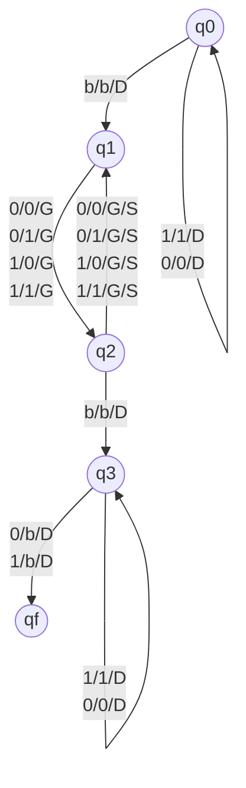
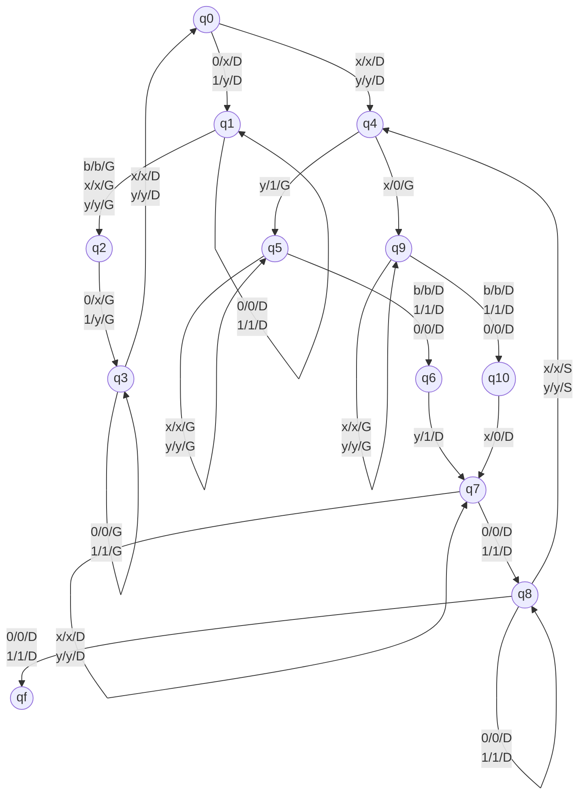
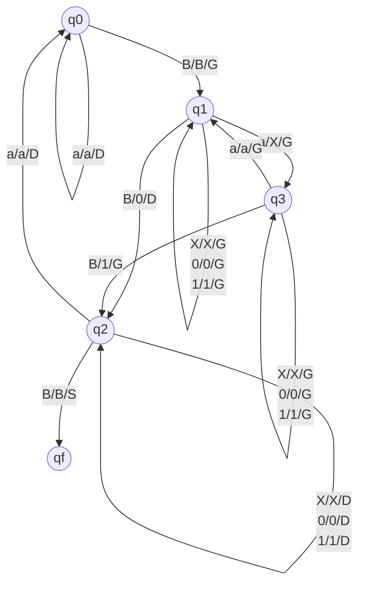
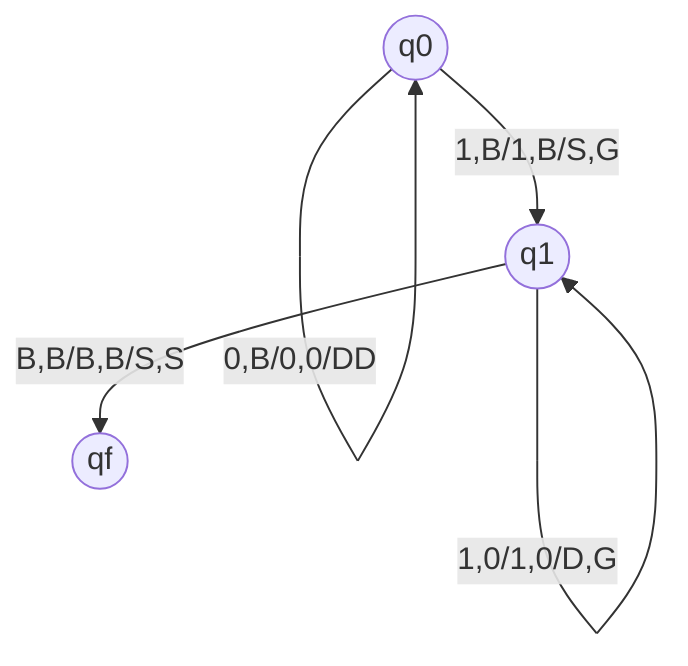
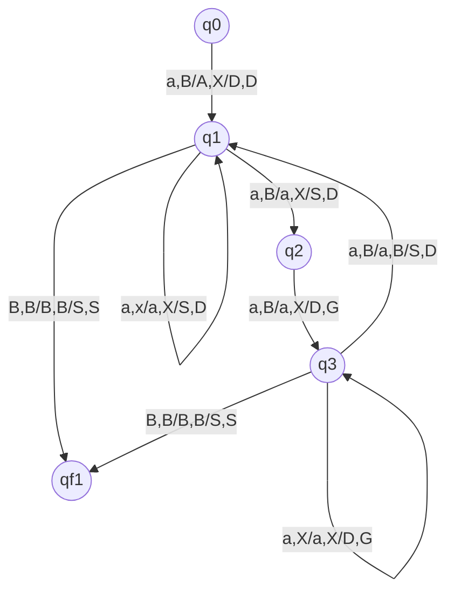
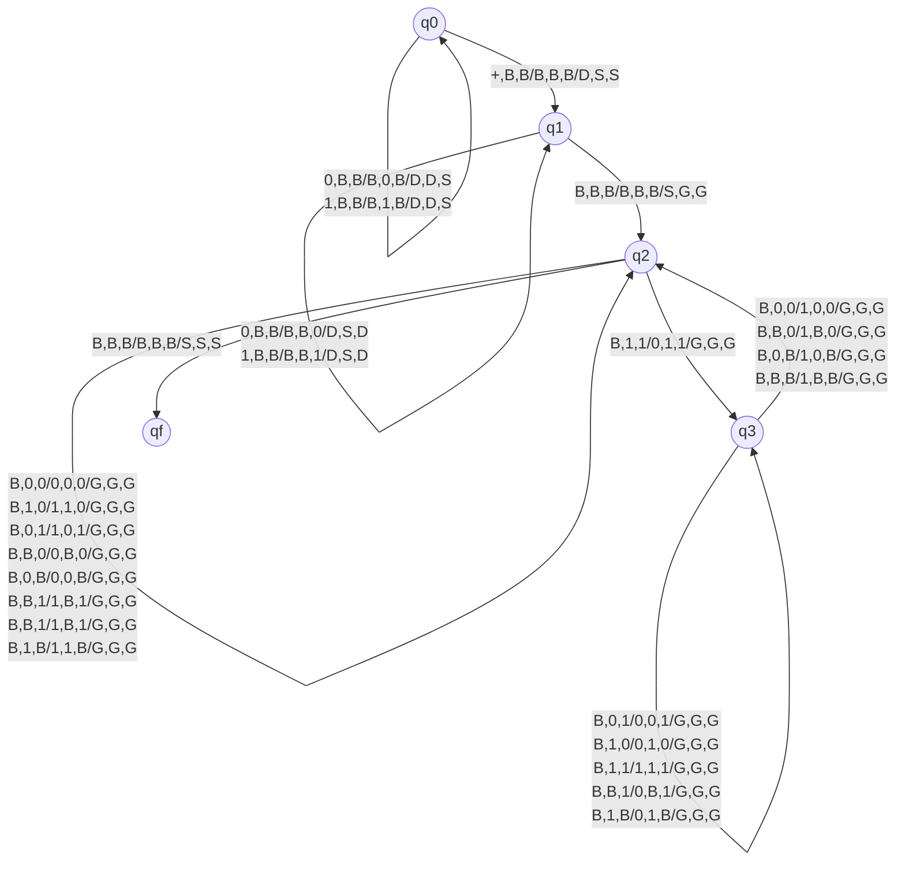

# TD2 
## Exo 1 

```mermaid
graph TB
    q0((q0)) --> | 1/1/D | q1((q1))
    q1((q1)) --> | 1/1/D | q1((q1))
    q1((q1)) --> | 0/0/D | q2((q2))
    q2((q2)) --> | 1/1/D | q3((q3))
    q3((q3)) --> | 1/1/D | q3((q3))
    q3((q3)) --> | B/B/S | qf((qf))

    %% etat poubelle
    q0((q0)) --> | 0/0/S<br/>B/B/S | poubelle((poubelle))
    q1((q1)) --> | B/B/S | poubelle((poubelle))
    q2((q2)) --> | 0/0/S<br/>B/B/S | poubelle((poubelle))
    q3((q3)) --> | 0/0/S | poubelle((poubelle))
```

## Exo 2

```mermaid
graph TB
    q0((q0)) --> | 1/1/D<br/>0/0/D | q0((q0))
    q0((q0)) --> | b/b/D | q1((q1))
    q1((q1)) --> | 0/0/G<br/>0/1/G<br/>1/0/G<br/>1/1/G | q2((q2))
    q2((q2)) --> | 0/0/G/S<br/>0/1/G/S<br/>1/0/G/S<br/>1/1/G/S | q1((q1))
    q2((q2)) --> | b/b/D | q3((q3))
    q3((q3)) --> | 1/1/D<br/>0/0/D | q3((q3))
    q3((q3)) --> | 0/b/D<br/>1/b/D | qf((qf))
```

```mermaid
graph TB
    q0((q0)) --> | 0/x/D<br/>1/y/D | q1((q1))
    q0((q0)) --> | x/x/D<br/>y/y/D | q4((q4))

    q1((q1)) --> | 0/0/D<br/>1/1/D | q1((q1))
    q1((q1)) --> | b/b/G<br/>x/x/G<br/>y/y/G | q2((q2))

    q2((q2)) --> | 0/x/G<br/>1/y/G | q3((q3))

    q3((q3)) --> | 0/0/G<br/>1/1/G | q3((q3))
    q3((q3)) --> | x/x/D<br/>y/y/D | q0((q0))

    q4((q4)) --> | y/1/G | q5((q5))
    q4((q4)) --> | x/0/G | q9((q9))

    q5((q5)) --> | x/x/G<br/>y/y/G | q5((q5))
    q5((q5)) --> | b/b/D<br/>1/1/D<br/>0/0/D | q6((q6))

    q6((q6)) --> | y/1/D | q7((q7))

    q7((q7)) --> | x/x/D<br/>y/y/D | q7((q7))
    q7((q7)) --> | 0/0/D<br/>1/1/D | q8((q8))

    q8((q8)) --> | 0/0/D<br/>1/1/D | q8((q8))
    q8((q8)) --> | x/x/S<br/>y/y/S | q4((q4))
    q8((q8)) --> | 0/0/D<br/>1/1/D | qf((qf))

    q9((q9)) --> | x/x/G<br/>y/y/G | q9((q9))
    q9((q9)) --> | b/b/D<br/>1/1/D<br/>0/0/D | q10((q10))

    q10((q10)) --> | x/0/D | q7((q7))
```

## Exo 3

```mermaid
graph TB
    q0((q0)) --> | a/a/D | q0((q0))
    q0((q0)) --> | B/B/G | q1((q1))
    q1((q1)) --> | X/X/G<br/>0/0/G<br/>1/1/G | q1((q1))
    q1((q1)) --> | B/0/D | q2((q2))
    q1((q1)) --> | a/X/G | q3((q3))
    q2((q2)) --> | X/X/D<br/>0/0/D<br/>1/1/D | q2((q2))
    q2((q2)) --> | B/B/S | qf((qf))
    q2((q2)) --> | a/a/D | q0((q0))
    q3((q3)) --> | X/X/G<br/>0/0/G<br/>1/1/G | q3((q3))
    q3((q3)) --> | a/a/G | q1((q1))
    q3((q3)) --> | B/1/G | q2((q2))
```

## Exo 4

```mermaid
graph TB
    q0((q0)) --> | 0,B/0,0/DD | q0((q0))
    q0((q0)) --> | 1,B/1,B/S,G | q1((q1))
    q1((q1)) --> | 1,0/1,0/D,G | q1((q1))
    q1((q1)) --> | B,B/B,B/S,S | qf((qf))
```

## Exo 5

```mermaid
graph TB
    q0((q0)) --> | a,B/A,X/D,D | q1((q1))
    q1((q1)) --> | a,x/a,X/S,D | q1((q1))
    q1((q1)) --> | B,B/B,B/S,S | qf1((qf1))
    q1((q1)) --> | a,B/a,X/S,D | q2((q2))
    q2((q2)) --> | a,B/a,X/D,G | q3((q3))
    q3((q3)) --> | a,X/a,X/D,G | q3((q3))
    q3((q3)) --> | a,B/a,B/S,D | q1((q1))
    q3((q3)) --> | B,B/B,B/S,S | qf1((qf1))
```

## Exo 6

```mermaid 
graph TB
    q0((q0)) --> | 0,B,B/B,0,B/D,D,S<br/>1,B,B/B,1,B/D,D,S | q0((q0))
    q0((q0)) --> | +,B,B/B,B,B/D,S,S | q1((q1))

    q1((q1)) --> | 0,B,B/B,B,0/D,S,D<br/>1,B,B/B,B,1/D,S,D | q1((q1))
    q1((q1)) --> | B,B,B/B,B,B/S,G,G | q2((q2))
    
    q2((q2)) --> | B,0,0/0,0,0/G,G,G<br/>B,1,0/1,1,0/G,G,G<br/>B,0,1/1,0,1/G,G,G<br/>B,B,0/0,B,0/G,G,G<br/>B,0,B/0,0,B/G,G,G<br/>B,B,1/1,B,1/G,G,G<br/>B,B,1/1,B,1/G,G,G<br/>B,1,B/1,1,B/G,G,G | q2((q2))
    q2((q2)) --> | B,1,1/0,1,1/G,G,G | q3((q3))
    q2((q2)) --> | B,B,B/B,B,B/S,S,S | qf((qf))

    q3((q3)) --> | B,0,1/0,0,1/G,G,G<br/>B,1,0/0,1,0/G,G,G<br/>B,1,1/1,1,1/G,G,G<br/>B,B,1/0,B,1/G,G,G<br/>B,1,B/0,1,B/G,G,G | q3((q3))
    q3((q3)) --> | B,0,0/1,0,0/G,G,G<br/>B,B,0/1,B,0/G,G,G<br/>B,0,B/1,0,B/G,G,G<br/>B,B,B/1,B,B/G,G,G | q2((q2))
```