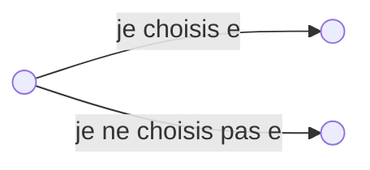

# TD3

Nom : **Somme de Sous-Ensembles**  
Instance : un ensemble fini $E$, une taille $s(e) \in N$ pour chaque $e \in E$ et une capacité $C \in N$.  
Question : existe-t-il un sous-ensemble $E' \subseteq E$ tel que la somme des éléments de $E' = C$ ?

## Exercice 1

Montrer que Somme de Sous-Ensembles est dans NP en décrivant une machine de Turing non-déterministe.

### Réponse exercice 1

La réponse est donc oui.

- Algorithme de vérification d'une solution en temps polynomial
Somme des éléments en entrée d'une taille $n$, complexité en temps $O(n)$

Le problème est donc NP

---

Soient les problèmes suivants.

Nom : **Chaîne Hamiltionienne**
Instance : Un graphe fini $G = (V, E)$ représenté sous forme de listes d’adjacence.
Question : Le graphe admet-il une chaîne Hamiltonienne (c’est-à-dire qui passe une et une seule fois par tous les sommets) ?

Nom : **Cycle Hamiltonien**
Instance : Un graphe fini $G = (V, E)$ représenté sous forme de listes d’adjacence.
Question : Le graphe admet-il un cycle Hamiltonien (c’est-à-dire qui passe une et une seule fois par tous les sommets) ?

Nom : **Chemin Hamiltionien**
Instance : Un graphe orienté fini $G = (V, E)$ représenté sous forme de listes d’adjacence.
Question : Le graphe admet-il un chemin Hamiltonienne (c’est-à-dire qui passe une et une seule fois par tous les sommets) ?

Nom : **Circuit Hamiltonien**
Instance : Un graphe orienté fini $G = (V, E)$ représenté sous forme de listes d’adjacence.
Question : Le graphe admet-il un circuit Hamiltonien (c’est-à-dire qui passe une et une seule fois par tous les sommets) ?

## Exercice 2

1. Chemin Hamiltionien $\propto$ circuit Hamiltonien
2. Cycle Hamiltonien $\propto$ circuit Hamiltonien
3. Chaîne Hamiltionienne $\propto$ chemin Hamiltionien
4. Cycle Hamiltonien $\propto$ chaîne Hamiltionienne
5. Circuit Hamiltonien $\propto$ chemin Hamiltionien
6. Circuit Hamiltonien $\propto$ cycle Hamiltonien
7. Chemin Hamiltionien $\propto$ chaîne Hamiltionienne

### Réponses exercice 2

1. **Chemin Hamiltionien $\propto$ circuit Hamiltonien**  
    Pour tout $G = (V, E) \xrightarrow[\text{Transformation polynomiale}]{} G' = (V', E')$

    $V' = V \cup \{x_0\}$  
    $E' = E \cup \{(x, v), (v, x), v \in V\}$

    $\Rightarrow$ On suppose qu'il existe un chemin Hamiltonien dans $G$  
    Soit $(v_0, v_1, \dots, v_n)$ avec $n = |V|$ ce chemin.  
    Construisons un circuit dans $G' : (x, v_0, v_1, \dots, v_n, x)$ car $(x, v_0)$ et $(v_n, x)$ sont des arcs de $E$

    $\Leftarrow$ S'il existe un circuit Hamiltonien de $G'$, alors en enelvant les arcs $x$ de ce circuit, on obtient un chemin Hamiltionien dans G.

    On a montré que : s'il existe un chemin Hamiltionien dans G si et seulement si il existe un circuit hamiltonien dans $G$.

    Donc chemin Hamiltionien $\propto$ circuit Hamiltonien

2. **Cycle Hamiltonien $\propto$ circuit Hamiltonie**n  
    Pour tout $G = (V, E)$

    $V' = V$  
    $E' = E \cup \{(v_0, v_1), \exists v_0, v_1 \in V, (v_0, v_1) \in E\}$

    $\Rightarrow$ On suppose qu'il existe un cycle Hamiltonien dans $G$ alors on a un circuit Hamiltonien dans $G'$ car les arcs du cycle dans $G$ sont symétriques.

    $\Leftarrow$ On suppose qu'il existe un cycle Hamiltonien dans $G'$ alors on a un circuit Hamiltonien dans $G$

    Donc cycle Hamiltonien $\propto$ circuit Hamiltonien

3. **Chaîne Hamiltionienne $\propto$ chemin Hamiltionien**
    Même transformation que dans la questions 2  
    Donc chaîne Hamiltionienne $\propto$ chemin Hamiltionien

4. **Cycle Hamiltonien $\propto$ chaîne Hamiltionienne**  
    Pour tout $G = (V, E)$  
    $V' = V \cup \{x', y, y'\}$  
    $E' = E \cup \{(y, v), v \in N_g(v)\} \cup \{x,x'\} \cup \{y, y'\}$

    $\Rightarrow$ Soit $(x, v_1, \dots, v_{n-1})$ un Cycle Hamiltonien dans $G$ $n = |V|$

    Considérons la chaine suivante : $(x', x, v_1, \dots, v_{n-1}, y, y')$
    Cette chaine est hamiltonienne car :
    - $\{x', x\} \in E'$
    - $\{x, v_1\} \in E'$
    - $\{v_i, v_{i+1}\} \in E'$ pout $i$ de $1$ à $n-2$
    - $\{v_{n-1}, y\} \in E'$ car les voisins de $x$ sont les voisins de $y$
    - $\{y, y'\} \in E'$

    $\Leftarrow$ S'il existe une chaine Hamiltonienne dans $G'$, dont les deux extrémités sont $x'$ et $y'$.  
    Soit $(x', x, v_1, \dots, v_{n-1}, y, y')$ une chaine hamiltonienne  
    Comme $\{y, v_{n-1}\}$  
    Donc $\{v_n, v_{n-1}\} \in E$  
    Finalement $(x, v_1, \dots, v_{n-1})$ est un Cycle Hamiltonien de $G$
5. **Circuit Hamiltonien $\propto$ chemin Hamiltonien**  
    Pour tout $G = (V, E)$  
    $V' = V \cup \{x, z\}$  
    $E' = E \cup \{(y, v), v \in N_{G,S}(v)\} \cup \{x, z\}$
    $\Rightarrow$ Soit $(x, v_1, \dots, v_{n-1})$ un circuit Hamiltonien de $G$  
    Le chemin $(y, v_1, \dots, v_{n-1}, x, z)$ est hamiltonien car :
    - $(y, v_1) \in E'$ car $(x, v_1) \in E'$ par hypothèse
    - $(x, z) \in E'$
    $\Leftarrow$ Soit $(y, v_1, \dots, v_{n-1}, x, z)$ un chemin hamiltonien  
    On montre que $(x, v_1, \dots, v_{n-1}, x)$ est un circuit Hamiltonien de car $(x, v_1) \in E'$ par construction de $G'$  
    (les voisins sortant de $y$ sont les voisins sortants de $x$)

Méthodologie pour "Q NP-Complet ?"

$P \propto Q$, $P$ NP-Complet  
$\Rightarrow$ si P est vrai alors Q est vrai  
$\Rightarrow$ si P est faux alors Q est faux  
$\Rightarrow$ Réduction en temps polynomial

---

Pour la suite, nous pourrons utiliser la NP-difficulté des problèmes suivants : chemin Hamiltionien, circuit Hamiltonien, cycle Hamiltonien, chaîne Hamiltionienne, Clique, Partition, 3-Dimensional Matching, X3-SAT.

Nom : **Clique**  
Instance : un graphe fini $G(V, E)$, et un entier positif $C \leq |V|$  
Question : le graphe admet-il une clique (sous-graphe complet) de cardinalité au moins C ?

Nom : **Partition**  
Instance : un ensemble fini d'entiers non-négatifs $A$.  
Question : existe-t-il une partition de $A$ en deux ensembles $A'$ et $A"$, telle que la somme des éléments de $A'$ soit égale à la somme des éléments de $A"$ ?

Nom : **3-Dimensional Matching**  
Instance : un ensemble $M$ de triplets $(w, x, y)$, avec $w$, $x$ et $y$ des éléments de trois ensembles $W$, $X$, $Y$ de même cardinalité $q$.  
Question : $M$ contient-il un couplage (un sous-ensemble de triplets contenant tous les éléments une fois et une seule) ?

Nom : **X3-SAT**  
Instance : une formule logique sous forme normale conjonctive, composée de clauses de degré exactement 3.  
Question : est-ce que la formule est satisfiable ?

## Exercice 3

Définition (Sous-graphe) : Le sous-graphe de $G = (V,E)$ engendré par un sous-ensemble des sommets $S$ de $V$ est le graphe $GS$ dont les sommets sont les sommets de $S$ et les arêtes sont celles de $G$ dont les deux extrémités sont dans $S$.

Définition (Graphe partiel) : Le graphe partiel de $G = (V,E)$ engendré par un sous-ensemble $A$ de l’ensemble des arêtes de $G$ est le graphe obtenu de $G$ en retirant les arêtes de $E \backslash A$.

Définition (Sous-graphe partiel) : Le sous-graphe partiel de $G$ est le sous-graphe d’un graphe partiel de $G$.

Montrer que le problème Isomorphisme de sous-graphes est NP-difficile.

Nom : **Isomorphisme de sous-graphes**  
Instance : deux graphes finis $G_1$ et $G_2$  
Question : $G_1$ contient-il un sous-graphe isomorphe à $G_2$ ?

## Exercice 4

Montrer que le problème Isomorphisme de sous-graphes partiels est NP-difficile.

Nom : **Isomorphisme de sous-graphes partiels**  
Instance : deux graphes finis $G_1$ et $G_2$  
Question : $G_1$ contient-il un sous-graphe partiel isomorphe à $G_2$ ?

## Exercice 5

Montrer que le problème Arbre couvrant de degré borné est NP-difficile.

Nom : **Arbre couvrant de degré borné**  
Instance : $G$ et un entier $k$  
Question : Existe-t-il un arbre couvrant de degré au plus k ?

## Exercice 6

Montrer que le problème Ordonnancement de tâches est NP-difficile.

Nom : **Ordonnancement de tâches**  
Instance : Soient $k$ tâches de durées respectives $t_1, \dots, t_k$ (durées entières), $T$ le temps total d’exécution autorisé et $n$ le nombre de processeurs.  
Question : Est-il possible d’exécuter les $k$ tâches sur une machine à $n$ processeurs en moins de $T$ unités de temps ?

## Exercice 7

Montrer que le problème Plus petit ensemble de tests est NP-difficile.

Nom : **Plus petit ensemble de tests**  
Instance : $P$ un ensemble de pannes possibles, $C$ une famille de sous-ensembles de $P$ représentant des tests, $J$ un entier  
Question : Existe-t-il un sous-famille de tests $C'$ de cardinalité au plus $J$ telle que pour toute
paire $p_i$, $p_j$ de pannes, il existe $c \in C'$ un test tel que $|\{p_i, p_j\} \cap c | = 1$. En d’autres termes, existe-t-il un test qui permette de distinguer la panne $p_i$ de la panne $p_j$ (pour tout $i$ et $j$).

## Exercice 8

Montrer que le problème Score est NP-difficile.

Nom : **Score**  
Instance : $G = (V, E)$ un graphe arête-pondéré non orienté dont les poids des arêtes sont des entiers non négatifs, $u$ et $v$ deux sommets et $S$ un entier.  
Question : Existe-t-il une chaîne simple de $u$ à $v$ de poids supérieur ou égal à $S$ ?

## Exercice 9

Montrer que le problème 3-Partition est NP-difficile.

Nom : **3-Partition**  
Instance : A un ensemble fini d’entiers non-négatifs  
Question : Existe-t-il une partition de $A$ en $A1$, $A2$ et $A3$ en trois ensembles de somme égale ?

## Exercice 10

Montrer que le problème Somme de sous-ensembles est NP-difficile (en utilisant X3-SAT dans la réduction).

Nom : **Somme de sous-ensembles**  
Instance : Un ensemble A d’entiers non négatifs et un entier $C$  
Question : Existe-t-il un sous-ensemble de A qui somme à $C$ ?  
