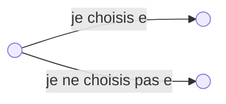

# TD3

Nom : **Somme de Sous-Ensembles**  
Instance : un ensemble fini $E$, une taille $s(e) \in N$ pour chaque $e \in E$ et une capacité $C \in N$.  
Question : existe-t-il un sous-ensemble $E' \subseteq E$ tel que la somme des éléments de $E' = C$ ?

## Exercice 1

Montrer que Somme de Sous-Ensembles est dans NP en décrivant une machine de Turing non-déterministe.

### Réponse exercice 1

La réponse est donc oui.

* Algorithme de vérificatio d'une solution en temps polynomial
Somme des éléments en entrée d'une taille $n$, complexité en temps $O(n)$

Le problème est donc NP

---

Soient les problèmes suivants.

Nom : **Chaîneham**
Instance : Un graphe fini $G = (V, E)$ représenté sous forme de listes d’adjacence.
Question : Le graphe admet-il une chaîne Hamiltonienne (c’est-à-dire qui passe une et une seule fois par tous les sommets) ?  

Nom : **Cycleham**
Instance : Un graphe fini $G = (V, E)$ représenté sous forme de listes d’adjacence.
Question : Le graphe admet-il un cycle Hamiltonien (c’est-à-dire qui passe une et une seule fois par tous les sommets) ?  

Nom : **Cheminham**
Instance : Un graphe orienté fini $G = (V, E)$ représenté sous forme de listes d’adjacence.
Question : Le graphe admet-il un chemin Hamiltonienne (c’est-à-dire qui passe une et une seule fois par tous les sommets) ?  

Nom : **Circuitham**
Instance : Un graphe orienté fini $G = (V, E)$ représenté sous forme de listes d’adjacence.
Question : Le graphe admet-il un circuit Hamiltonien (c’est-à-dire qui passe une et une seule fois par tous les sommets) ?

## Exercice 2

1. Cheminham $\propto$ Circuitham
2. Cycleham $\propto$ Circuitham
3. Chaîneham $\propto$ Cheminham
4. Cycleham $\propto$ Chaîneham
5. Circuitham $\propto$ Cheminham
6. Circuitham $\propto$ Cycleham  
7. Cheminham $\propto$ Chaîneham  

### Réponse exercice 2

1. 

---

Pour la suite, nous pourrons utiliser la NP-difficulté des problèmes suivants : Cheminham, 
Circuitham, Cycleham, Chaîneham, Clique, Partition, 3-Dimensional Matching, X3-SAT. 
 
Nom : Clique  
Instance : un graphe fini G(V,E), et un entier positif C ≤ |V| 
Question : le graphe admet-il une clique (sous-graphe complet) de cardinalité au moins C ? 
 
Nom : Partition  
Instance : un ensemble fini d'entiers non-négatifs A. 
Question : existe-t-il une partition de A en deux ensembles A' et A", telle que la somme des 
éléments de A' soit égale à la somme des  
éléments de A" ? 
 
Nom : 3-Dimensional Matching  
Instance : un ensemble M de triplets (w,x,y), avec w, x et y des éléments de trois ensembles 
W, X, Y de même cardinalité q. 
Question : M contient-il un couplage (un sous-ensemble de triplets contenant tous les 
éléments une fois et une seule) ? 
 
Nom : X3-SAT  
Instance : une formule logique sous forme normale conjonctive, composée de clauses de 
degré exactement 3. 
Question : est-ce que la formule est satisfiable ? 
 
 
Exercice 3 : 
 
Définition (Sous-graphe) :  Le  sous-graphe  de  G  =  (V,E)  engendré  par  un  sous-ensemble  des 
sommets S de V est le graphe GS dont les sommets sont les sommets de S et les arêtes sont 
celles de G dont les deux extrémités sont dans S. 
 
Définition (Graphe partiel) : Le graphe partiel de G = (V,E) engendré par un sous-ensemble A 
de l’ensemble des arêtes de G est le graphe obtenu de G en retirant les arêtes de E \ A. 
 
Définition (Sous-graphe partiel) : Le sous-graphe partiel de G est le sous-graphe d’un graphe 
partiel de G. 
 
Montrer que le problème Isomorphisme de sous-graphes est NP-difficile. 
 
Nom : Isomorphisme de sous-graphes 
Instance : deux graphes finis G1 et G2 
Question : G1 contient-il un sous-graphe isomorphe à G2 ? 
