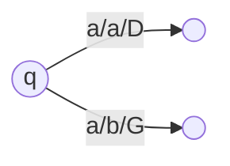
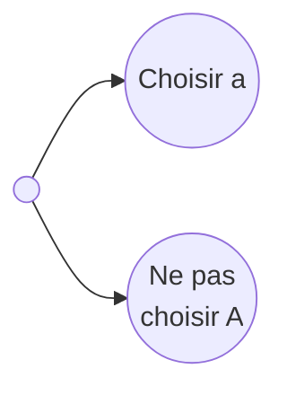

# Cours algorithmique et complexité

# 12/09/2022

- mail du prof : dorian.mazauric@inria.fr
- mail prof de td : bridoux@i3s.unice.fr

# 19/09/2022

## Machine de Turing

Machine de Turing est un modèle mathématique de calcul. Elle est composée d'une bande infinie de cellules, d'une tête de
lecture et d'un état. La tête de lecture peut lire, écrire et se déplacer sur la bande. La machine de Turing est définie
par un programme qui décrit les actions à effectuer en fonction de l'état et du symbole lu.

Machine de Turing (1936) - Modèle de calcul

Composition d'une machine de Turing :

- Une ou plusieurs bandes/ruban
- Une unité de contrôle
- Chaque bande est divisée en cases
- Chaque case contient un symbole d'un alphabet fini
- Tetes de lecture/écriture permet de lire/écrire dans une case

## Machine de Turing à K rubans

- Q : ensemble fini d'états de la machine
- T : alphabet de la machine, ensemble fini de symboles que l'on peut utiliser sur les bandes
- I : sous-ensemble de l'ensemble de données
- δ : fonction de transition $Q \times T^X \to Q \times (T \times \{G,D,S\})^K$
- B : symbole blanc
- $q_0$ : état initial
- $q_f$ : état final

Exemple de machine de Turing à 2 rubans : palindromes

ruban 1 : ... | K | A | Y | A | K | ...

ruban 2 : ... | B | B | B | B | B | ...$

# 26/09/2022

Temps de calcul d'une machine de Turing (MT), est une fonction de T(n) avec n la taille des données

T(n) nombre maximum de transitions pour une donnée de taille n

## Théorème

Si le langage `L` est accepté par une machine de Turing `T` à `k` bandes alors il existe une machine de Turing `T'` à 1
bande qui reconnaît le même langage `L`.

### Théorème de l'accélération

Si L est accepté par une machine de turing à bande (`k>1`) en un temps `T(n)` (avec $\lim\limits_{x \to \infty} \frac{T(
n)}{n} = +\infty$) alors pour toute constante réelle `c>0`, il existe une machine de turing à `k` bandes acceptant `L`
en un temps `c T(n)`

### Preuve

1. Nous encodons de la manière suivante les cases de MT $\longrightarrow$ 1 case de MT
2. Ce codage permet plusieurs transitions à la fois.
   En effet, une lecture donne l'information de `n` cases de MT.
   Donc on peut effectuer tout le travail de ces `n` lectures.
   Chaque phase de base de `MT' >= m` transitions de `MT`
   Pour MT', on va lire 3 cases voisines ($3^m$ cases dans MT)  
   $T'(n) < 2n + \frac{8T(n)}{m}$  
   Il faut choisir `m` pour que $T'(n) \leq c T(n)$  
   $m > \frac{16}{c}$  
   $\Rightarrow \frac{8T(n)}{m} < \frac{c}{2}n < c T(n) - 2n$  
   pour `n` suffisamment grand.

# 03/10/2022

## Manière de formaliser un problème

- Nom du problème
- Données du problème (codage inclus)
- Une question qui a deux réponses possibles OUI ou NON

### Exemple

- Nom : Sac a dos (Knapsack)
- Données :
    - ensemble fini d'objets $E$
    - une fonction entière $v$ qui associe une valeur à chaque objet
    - une fonction entière $p$ qui associe un poids à chaque objet
    - un poids total $P$
    - une valeur totale minimale $V$
- Question : pouvons-nous choisir des objets de manière à ne pas dépasser le poids total $P$ et à avoir une valeur
  totale au moins $V$ ?

*Réduction polynomiale :*

$P_1$ et $P_2$ deux problèmes (de décision)
$P_1$ peut être réduit à $P_2$ s'il existe une transformation associant à chaque instance $I_1$ de $P_1$ une instance
$f(I_1$) de $P_2$ telle que :
la réponse à $I_1$ est OUI si et seulement si la réponse à $f(I_1)$ est OUI

$P_1$ : Chaine hamiltonienne
Graphe G = (V,E) (liste d'adjacence)
Est-ce qu'il existe une chaine qui permet de passer une fois et une seule par chaque sommet de G ?

$P_2$ : Cycle hamiltonien
Graphe G = (V,E) (liste d'adjacence)
Est-ce qu'il existe un cycle qui permet de passer une fois et une seule par chaque sommet de G ?

Nous montrons que G admet une chaine hamiltonienne si et seulement si G' admet un cycle hamiltonien

"$\Leftarrow$" : considérons un cycle hamiltonien de $G$ : "moins $x_0$"alors on obtient une chaine hamiltonienne de $G$

"$\Rightarrow$" : Si G admet une chaine hamiltonienne, alors on ajoute 2 arêtes des extrémités de la chaine vers $x_0$
et on obtient un cycle hamiltonien dans $G'$ avec $x_0$

Finalement, $p_1$ $\leq$ $p_2$

# Classique en DS

TD2 : exo4 variante ${a_k, b_k}$  
et vérifier la parité d'un nombre

# 10/10/2022

## P et NP

**Définition** : P est la classe des problèmes qu'il est possible de résoudre en temps *polynomial* avec une machine de
Turing *déterministe*.

Cette machine est non déterministe :

Plusieurs transitions à partir d'un même état.

**Définition** : NP (Nondeterministic Polynomial) non déterministe polynomial est la classe de problèmes qu'il est
possible de résoudre en un temps polynomial avec une machine de Turing non déterministe.

Exemple :

- Partition
- Entrée : un ensemble A non négatif (écrit en base $k => 2$)
- Question : Est-ce qu'il existe un sous ensemble $A_1 <= A$ tel que $\sum_{a \in A_1} a = \sum_{a' \in A \backslash
  A_1} a'$

Un problème $\Pi$ est NP-complet si et seulement si (classe les plus difficiles de NP) :

- $\Pi$ est dans NP  
  Comment ?
    - Machine de Turing non déterministe
    - On peut vérifier une solution en un temps polynomial

- Tout problème $\Pi'$ dans NP peut être réduit polynomialement à $\Pi$
  Comment ?
    - On trouve un problème $\Pi'$ qui est NP-Complet et tel qu'il existe $\Pi' \propto \Pi$
